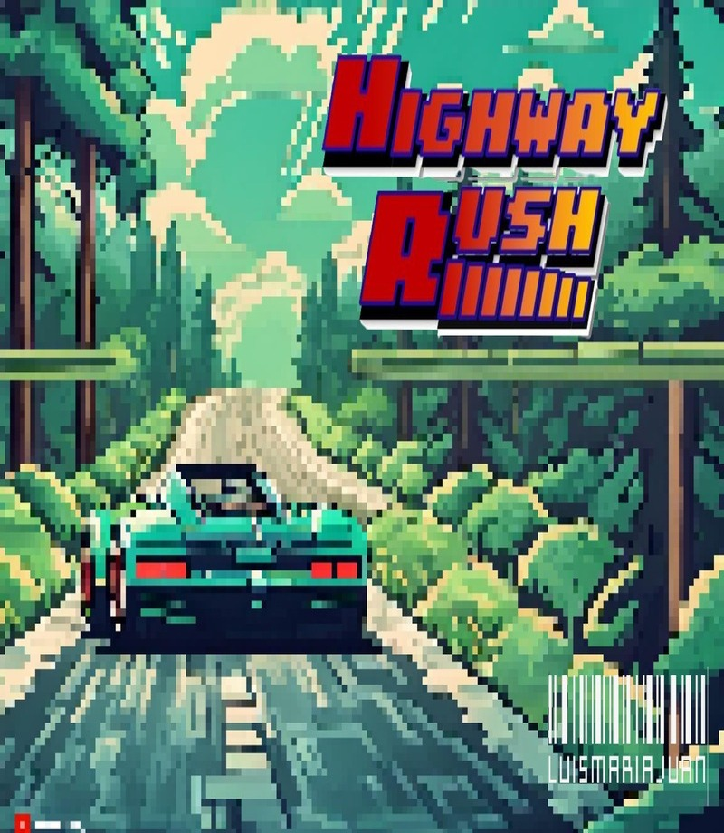
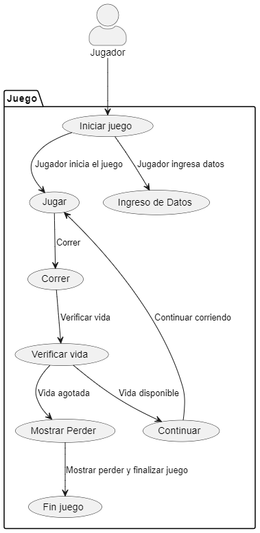
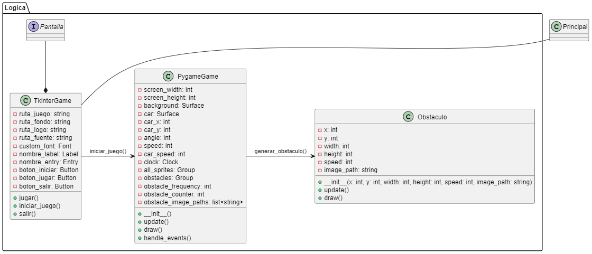
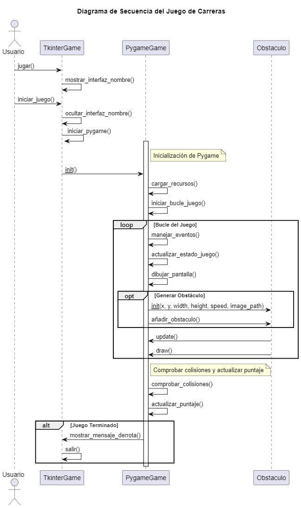

# HIGHWAY RUSH
## El asfalto está caliente. La competencia es feroz. ¿Tienes lo necesario para llegar a la cima?

En los bulliciosos caminos de la ciudad, donde el sonido de los motores retumba, se desata una competencia legendaria. ¡Bienvenido a "Highway Rush", el juego de carreras que te llevará de vuelta a los días dorados de los arcades retro!

Prepárate para una emocionante aventura en 2D, donde la velocidad es la moneda de cambio y el desafío nunca termina. Enfréntate a carreteras interminables, esquiva obstáculos y supera a tus rivales en una carrera contra el tiempo.

# Características:
1. Carretera Infinita: El juego presenta una carretera sin fin que se extiende hacia el horizonte, ofreciendo una experiencia de carrera continua y emocionante.

2. Jugabilidad Simple y Adictiva: Con controles sencillos e intuitivos, los jugadores pueden sumergirse rápidamente en la acción y disfrutar de una experiencia de juego adictiva.

3. Esquivar Obstáculos: Los jugadores deben esquivar una variedad de obstáculos en la carretera, incluyendo vehículos lentos, barreras y obstáculos en movimiento, desafiando sus reflejos y habilidades de maniobra.

4. Velocidad y Competencia: Experimenta la emoción de la velocidad mientras compites contra otros vehículos en la carretera. Adelanta a tus oponentes y alcanza velocidades vertiginosas mientras intentas llegar lo más lejos posible.

5. Gráficos Retro y Estilo 2D: Sumérgete en un ambiente retro con gráficos 2D que evocan la nostalgia de los clásicos juegos de carreras, pero con un toque moderno y vibrante.

6. Puntuación y Logros: Compete por la puntuación más alta. ¿Puedes alcanzar la cima de la tabla de clasificación y convertirte en el mejor piloto de "Highway Rush"?

7. Música y Sonido Envolventes: Disfruta de una banda sonora trepidante y efectos de sonido envolventes que te sumergirán por completo en la experiencia de la carrera.

# Desarrollo:
"Highway Rush" fue concebido como un juego de carreras arcade en 2D con un enfoque en la acción rápida y la jugabilidad sencilla pero adictiva. El objetivo principal del proyecto era crear una experiencia de juego emocionante y desafiante que capturara la esencia de los clásicos juegos de carreras retro.

El desarrollo comenzó con la planificación de las características principales del juego, que incluían una carretera infinita generada proceduralmente, controles simples pero responsivos, obstáculos variados y un sistema de puntuación para fomentar la competitividad entre los jugadores.

Se utilizó Python junto con las bibliotecas Pygame y Tkinter para el desarrollo del juego. Pygame proporcionó las herramientas necesarias para la creación de gráficos, animaciones y detección de colisiones, mientras que Tkinter se utilizó para la interfaz de usuario y la integración con el sistema operativo.

El proceso de desarrollo incluyó varias etapas, como el diseño de los gráficos y la música, la implementación de la lógica del juego y la optimización del rendimiento para garantizar una experiencia de juego fluida en una variedad de dispositivos.

Después de varias iteraciones y pruebas exhaustivas, "Highway Rush" fue finalizado y listo para su lanzamiento. El juego fue bien recibido por los jugadores, que elogiaron su jugabilidad adictiva, su estética retro y su capacidad para ofrecer una experiencia de carreras emocionante y desafiante.

# Diagramas:
## Diagramas Casos de Uso:
El presente diagrama de casos de uso se enfoca en brindar una visión exhaustiva de las interacciones entre los distintos actores y el sistema de un emocionante juego de carreras. Los juegos de carreras no solo ofrecen entretenimiento, sino que también desafían la destreza y la habilidad de los jugadores a medida que compiten en emocionantes circuitos y enfrentan diversas situaciones en tiempo real.

Este diagrama representa los casos de uso principales que abarcan las funcionalidades esenciales del juego, desde la selección de vehículos hasta la competición en pistas dinámicas y la gestión de recursos y progresión del jugador. Además, se identifican los distintos roles de los usuarios, como jugadores individuales y multijugador, así como posibles observadores o espectadores de las carreras.

Al comprender las diversas interacciones entre los usuarios y el sistema, este diagrama sienta las bases para el diseño y la implementación efectiva del juego, garantizando una experiencia de juego emocionante y satisfactoria para todos los participantes.

## Diagramas Clases:
El diagrama de clases es una representación visual crucial en el diseño y desarrollo de sistemas orientados a objetos, como es el caso de los juegos de carreras. Este tipo de diagrama proporciona una vista estática de la estructura del sistema, identificando las clases, sus atributos y métodos, así como las relaciones entre ellas.

En el contexto de un juego de carreras, el diagrama de clases permite visualizar la arquitectura subyacente del juego, desde la representación de los vehículos y sus características hasta la gestión de los distintos elementos del entorno de la carrera. Además, se identifican las relaciones de herencia, asociación y composición entre las clases, lo que ayuda a comprender cómo interactúan los diferentes componentes del sistema.

Este diagrama proporciona una base sólida para el diseño e implementación del juego, permitiendo a los desarrolladores tener una comprensión clara de la estructura del sistema y facilitando la colaboración entre los equipos de desarrollo.

## Diagramas Secuencia:
El diagrama de secuencia es una herramienta esencial en el análisis y diseño de sistemas interactivos, como los juegos de carreras, ya que permite visualizar las interacciones entre los distintos objetos y componentes del sistema a lo largo del tiempo. Este tipo de diagrama muestra la secuencia de mensajes intercambiados entre los objetos durante la ejecución de un escenario específico, lo que facilita la comprensión del flujo de eventos y la lógica subyacente del sistema.

En el contexto de un juego de carreras, el diagrama de secuencia captura las interacciones entre los diversos elementos del juego, como los jugadores, los vehículos, el entorno y otros objetos relevantes. Desde la selección de un vehículo hasta la finalización de una carrera, este diagrama ilustra cómo se desencadenan y coordinan las acciones de los diferentes elementos del juego en respuesta a las decisiones y acciones de los jugadores.

Al proporcionar una representación visual de las secuencias de eventos en el juego, este diagrama es una herramienta invaluable para comprender y analizar el comportamiento dinámico del sistema, lo que ayuda a identificar posibles problemas de diseño y a optimizar la experiencia del jugador.

# Integrantes:
- María José Patiño Vera - 20232020053
- Juan Camilo Carvajal Camargo - 20232020026
- Luis Santiago Mesa Bautista - 20232020041
